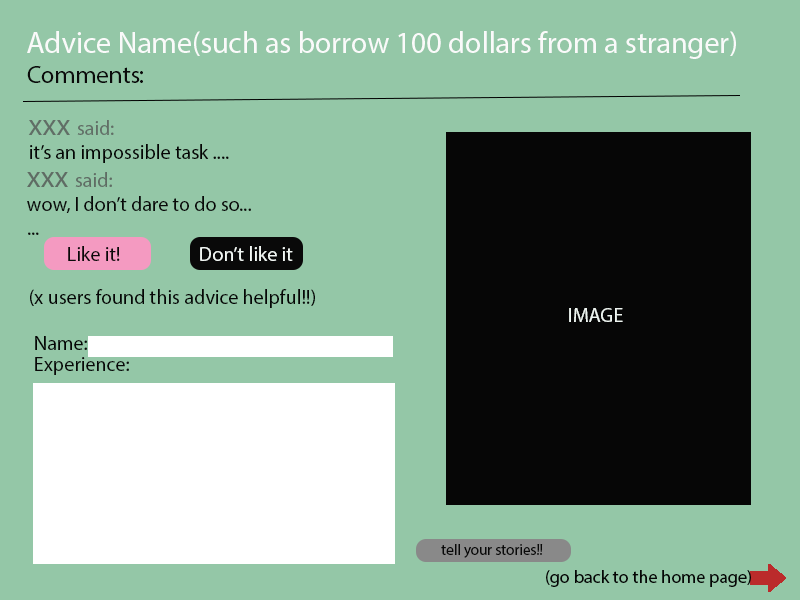

# Rejection Therapy Program

## Overview

Feeling afarid of getting rejected is a problem for many people. It hinders us from taking the first step and getting what we really want. Do you have the experience of missing an opportunity just because you are too timid to catch it?

This Rejection Therapy Program is an web application that aimed to help people conquer their fear of rejection by getting them used to rejection and learn to embrace it eventually. Once the user log in to this app, they will get an to do list, they cannot jump over any of item in the list, and it is mandatory for a everyday basis. But what they can do is to share their idea, and add to the to do list, so that other user can see it. And in each of the listing idea, there will be a sharing section, which allows user to share their exprience and progress.


## Data Model

The application will store User, lists

* users can only have one list which is the same for all the users
* each list can multiple comments (by embedding)


An Example User:

```javascript
{
  username: "Someone",
  hash: *********
}

```

An Example List with Embedded Advice:

```javascript
{
  user: "Qiuxuan",
  advice: "Go out and borrow 100 dollars from a stranger",
  count: 0, // you can downvote and upvote
  comments: [
    { name: "someone", experience: "I actually succeeded"},
    { name: "pedestrian", experience: "Although I failed, I took the first step at least"}
  ],
  createdAt: // timestamp
}
```
An Exmaple Comment:

``` javascript

{
	text: "It's very helpful!",
	user: "somebody"
}
```


## [Link to Commented First Draft Schema](db.js) 


## Wireframes


/list/index - page for showing the homepage, with all advice on it


/about - page for showing the introduction to this program


/list/slug - page for showing specific comments page for each advice



## Site map


Here's a 

## User Stories or Use Cases

(___TODO__: write out how your application will be used through [user stories](http://en.wikipedia.org/wiki/User_story#Format) and / or [use cases](https://www.mongodb.com/download-center?jmp=docs&_ga=1.47552679.1838903181.1489282706#previous)_)

1. as non-registered user, I can register a new account with the site
2. as a user, I can log in to the site
3. as a user, I can create a new grocery list
4. as a user, I can view all of the grocery lists I've created in a single list
5. as a user, I can add items to an existing grocery list
6. as a user, I can cross off items in an existing grocery list

## Research Topics

(___TODO__: the research topics that you're planning on working on along with their point values... and the total points of research topics listed_)

* (5 points) Integrate user authentication
    * I'm going to be using passport for user authentication
    * And account has been made for testing; I'll email you the password
    * see <code>cs.nyu.edu/~jversoza/ait-final/register</code> for register page
    * see <code>cs.nyu.edu/~jversoza/ait-final/login</code> for login page
* (4 points) Perform client side form validation using a JavaScript library
    * see <code>cs.nyu.edu/~jversoza/ait-final/my-form</code>
    * if you put in a number that's greater than 5, an error message will appear in the dom
* (5 points) vue.js
    * used vue.js as the frontend framework; it's a challenging library to learn, so I've assigned it 5 points

10 points total out of 8 required points (___TODO__: addtional points will __not__ count for extra credit_)


## [Link to Initial Main Project File](app.js) 

(___TODO__: create a skeleton Express application with a package.json, app.js, views folder, etc. ... and link to your initial app.js_)

## Annotations / References Used

(___TODO__: list any tutorials/references/etc. that you've based your code off of_)

1. [passport.js authentication docs](http://passportjs.org/docs) - (add link to source code that was based on this)
2. [tutorial on vue.js](https://vuejs.org/v2/guide/) - (add link to source code that was based on this)
