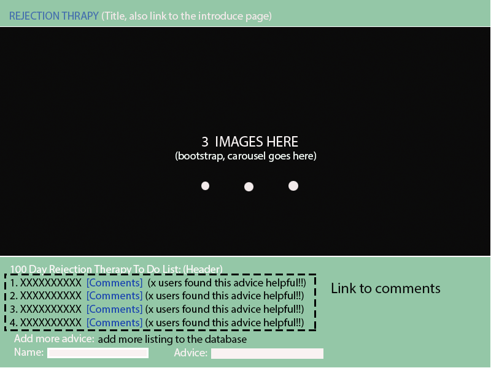
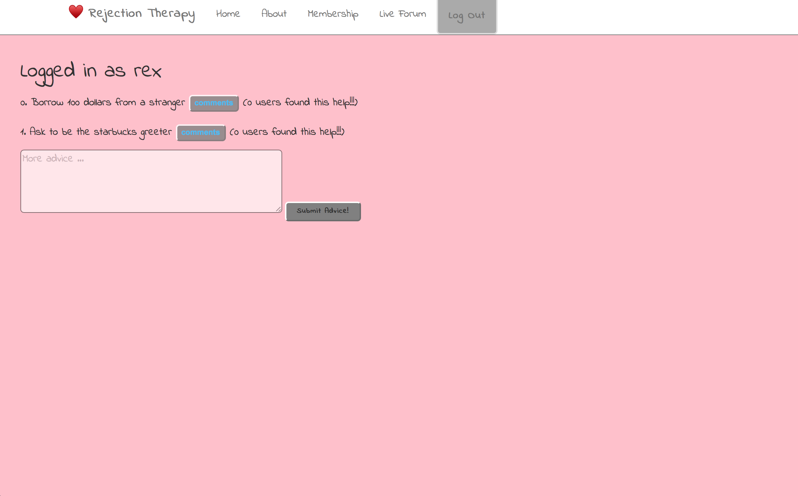
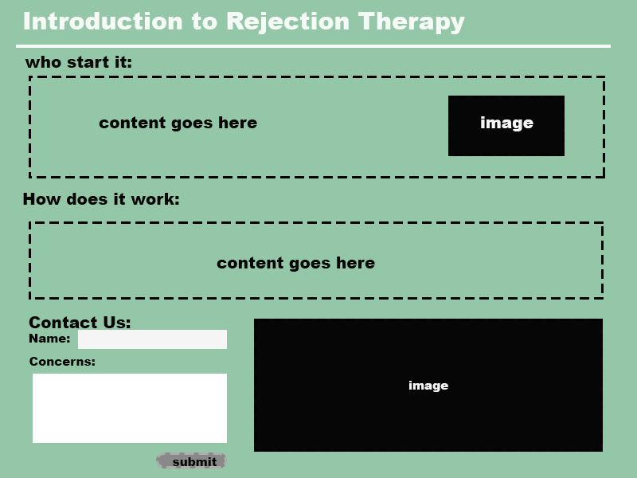
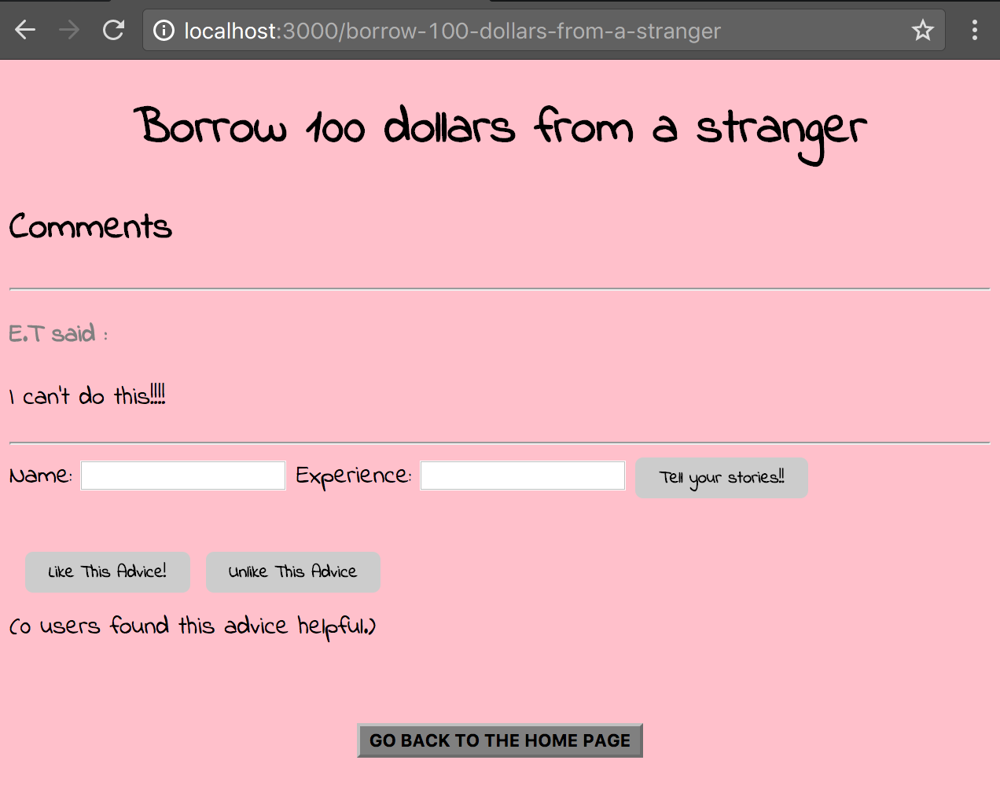
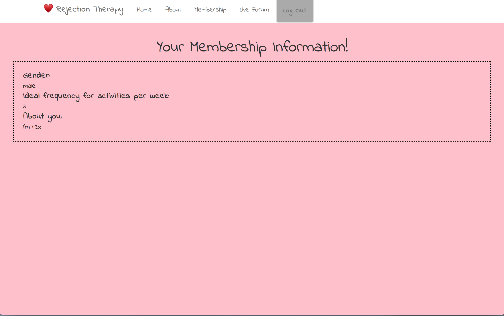
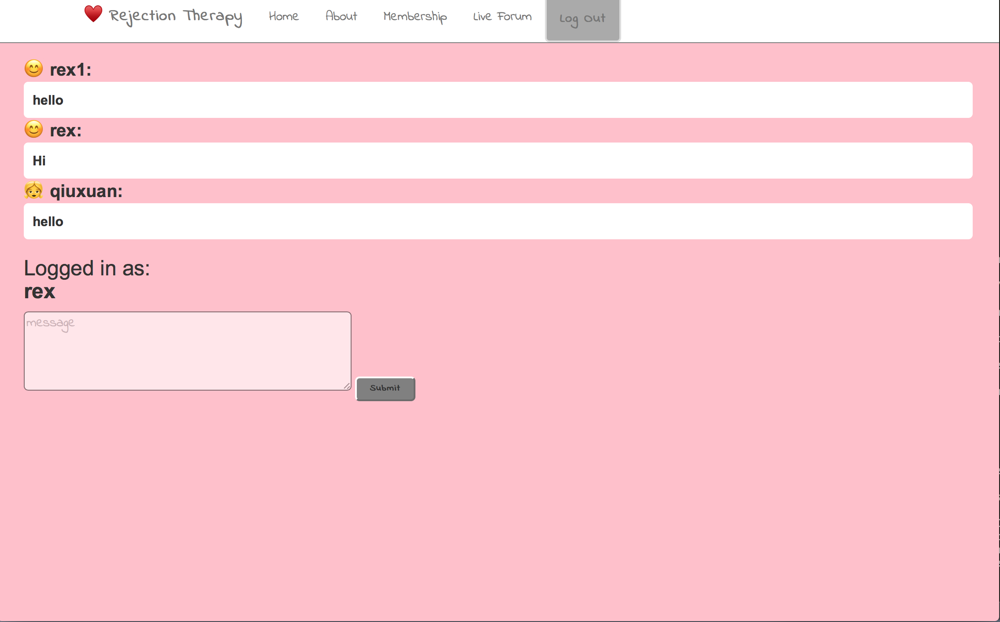
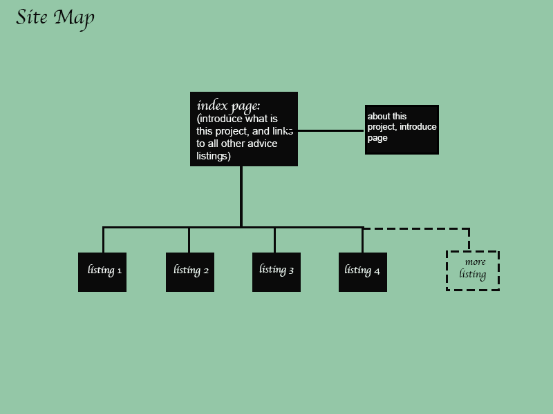

# Rejection Therapy Program

## Overview

Feeling afarid of getting rejected is a problem for many people. It hinders us from taking the first step and getting what we really want. Do you have the experience of missing an opportunity just because you are too timid to catch it?

This Rejection Therapy Program is an web application that aimed to help people conquer their fear of rejection by getting them used to rejection and learn to embrace it eventually. Once the user log in to this app, they will get an to do list, they cannot jump over any of item in the list, and it is mandatory for a everyday basis. But what they can do is to share their idea, and add to the to do list, so that other user can see it. And in each of the listing idea, there will be a sharing section, which allows user to share their exprience and progress.


## Data Model

The application will store User, lists and Messages

* users can only have one list which is the same for all the users
* each list can multiple comments (by embedding)
* message retrive what the user say, and display it to the public through ajax


An Example User:

```javascript
{
  username: "Someone",
  hash: *********
}

```

An Example List with Embedded Advice:

```javascript
{
  user: "Qiuxuan",
  advice: "Go out and borrow 100 dollars from a stranger",
  count: 0, // you can downvote and upvote
  comments: [
    { name: "someone", experience: "I actually succeeded"},
    { name: "pedestrian", experience: "Although I failed, I took the first step at least"}
  ],
  createdAt: // timestamp
}
```
An Exmaple Comment:

``` javascript

{
	text: "It's very helpful!",
	user: "somebody"
}
```
Am Example Message

``` javascript

{
    message: Hi,
    from: username,
    gender: user.gender,
};

```


## [Link to Commented First Draft Schema](db.js) 


## Wireframes


/index - page for showing the homepage



/list - page for showing all the advice



/about - page for showing the introduction to this program



/slug - page for showing specific comments page for each advice



/signup - page for signup for the membership



/chat - page for talking in the live forum,
how ever, this page using ajax interaction, and you can only see the message when you click on the box.



## Site map


Here's a site map:


## User Stories or Use Cases

1. as non-registered user, I can register a new account with the site
2. as a user, I can log in to the site
3. as a user, I can add an advice to the listing
4. as a user, I can downvote and upvote an advice
5. as a user, I can comment on an existing advices
5. as a user, I can talk in the live forum


## Research Topics


* Integrate user authentication (5 points)
	* user authentication is a process  that allows a device to verify the identity of someone who connects to a network resource
	* It compared the credentials provided  to those on file in a database of authorized users' information on a local operating system. In this way, it prevents some of the user's information to be seen by others, and it also gives users access and modification right.
	* We can use passport.js to implement user authentication
	* There are several the most common way to implement it:
		1. [passport-local](https://github.com/jaredhanson/passport-local) : which is local account logins and signups, you can signup with your email and receive an verification email about your account. 
		2. [passport-facebook](https://github.com/jaredhanson/passport-facebook) : which allows us to login and register via facebook
		3. [password-hash](https://github.com/shaneGirish/bcrypt-nodejs) : using bcript-node.js to create password hash for local accounts.
		
* Perform client side form validation using a JavaScript library (3 points)
    * Client side form validation is check if the information the user send to the form is correct or not before they send the form to the server
    * if the information the user input is what the form required, show error message to the user and don't allow them to submit invalid information
    * We can implement this via javascript functions
    * in the following example, if a form field is empty, this function will alerts a message and return false to prevent the form from being submitted
   	``` javascripy
   	function validateForm() {
    	var x = document.forms["myForm"]["fname"].value;
   	 if (x == "") {
        alert("Name must be filled out");
        return false;
    }

   	```
   	* we call the above function when the form is submitted by:
   	``` javascript

   	<form name="myForm" action="/action_page_post.php" onsubmit="return validateForm()" method="post">
		Name: <input type="text" name="fname">
		<input type="submit" value="Submit">
	</form>


   	```

   	* Note: javascript also allows us to validate numeric input


		
	
* Bootstrap.js (2 points)

  1.Bootstrap is a free and open-source front-end web framework for designing websites and web applications. It contains HTML- and CSS-based design templates for typography, forms, buttons, navigation and other interface components, as well as optional JavaScript extensions. Unlike many web frameworks, it concerns itself with front-end development only.

	2.Bootstrap is modular and consists of a series of Less stylesheets that implement the various components of the toolkit. These stylesheets are generally compiled into a bundle and included in web pages, but individual components can be included or removed. Bootstrap provides a number of configuration variables that control things such as color and padding of various components.

	3.Bootstrap comes with several JavaScript components in the form of jQuery plugins. They provide additional user interface elements such as dialog boxes, tooltips, and carousels. They also extend the functionality of some existing interface elements, including for example an auto-complete function for input fields. In version 2.0, the following JavaScript plugins are supported: Modal, Dropdown, Scrollspy, Tab, Tooltip, Popover, Alert, Button, Collapse, Carousel and Typeahead.


* Ajax Interaction
  1. Ajax stands for Asynchronous JavaScript and XML. It is a technique that allow web page to be update without refresh the page. It is a client side script that communicates to and from a server without the need for a postback.
  2. It is used to perform a callback, making a quick round trip to and from the server to retrieve data without posting the entire page back to the server, so thet network utilization is minimizaed and quicker operations occurs. 
  3. Ajax allows you to make asynchronous calls to a web server, avoiding waiting for all data to arrive before alloing the user to act once more


## [Link to Initial Main Project File](app.js) 


# Attribution
 1. boostrap code based on [getbootstrap.com](https://v4-alpha.getbootstrap.com/components/carousel/)
 2. passport code based on [passportjs.org](http://passportjs.org/docs)
 3. ajax code based on [class example code](https://github.com/nyu-csci-ua-0480-008-spring-2017/examples/tree/master/class22/chat/public/javascripts)


