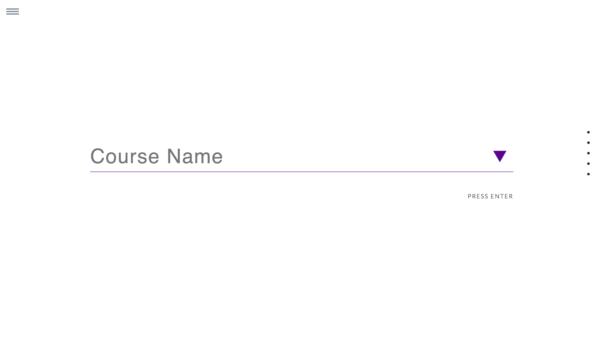

# NYU COURSE RECOMMENDATION SYSTEM


1. Download mongoDB, and initialize you local mongoDB by typing ```mongod``` in the terminal 

2. npm install express, hbs and all the absent packages

3. in the web-application root directory, run ```node app.js``` and access the webiste on ```http://localhost:3000```, depending on people's browser configuration, sometimes you can't access the website via safari, because it cannot establish a safe connection. You can try with chrome, and if there's a security warning, click the advanced button to enable access to the website.


/ this is the page for log in and sign up, with media query that keeps the page looks good with different browser size


/about this is the page that briefly introduces what is this application for


The navigation bar that show across the site


/question our question page that contains a form that asking for user personal information


/transcript the page that allow user to input the information and ratings of courses they have taken


we enable autocomplete to some field that will significantly influence the result if the input is wrong


/profile show all the information the user filled in and allow them to makes changes to it


/recommend reommendation page that allow user to input multiple class(maximum 5), and also allow them to remove course they add, and finally recommend the best section for each of the class.


